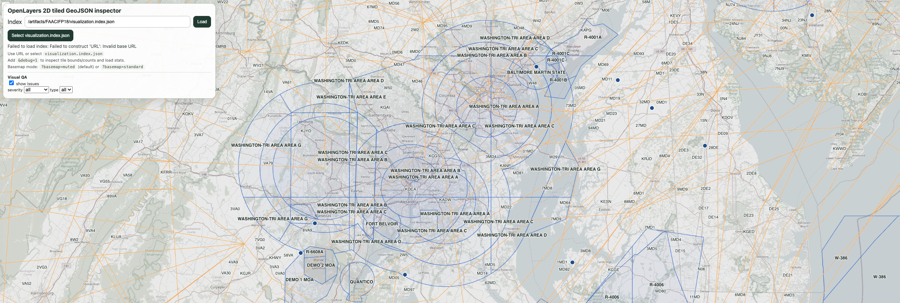
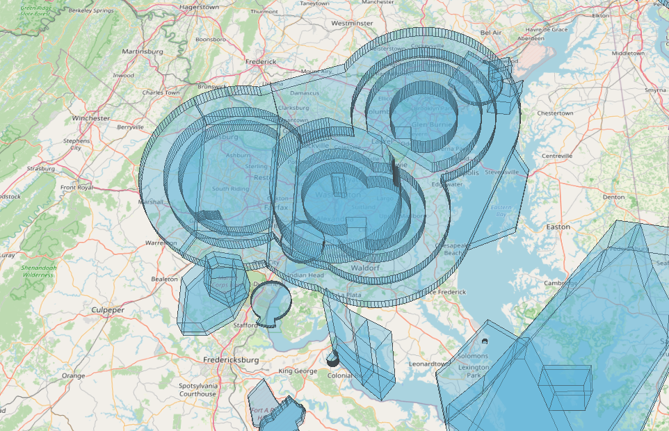

# arinc424-toolkit (Workspace Monorepo)

Modular Node.js platform for ARINC 424 ingestion, canonical normalization, feature transformation, pure-JS tiling, and Cesium 3D tile generation.

## Packages

- `@arinc424/toolkit`: convenience metapackage (single install entrypoint)
- `@arinc424/core`: ARINC parsing + canonical model
- `@arinc424/features`: canonical -> feature model
- `@arinc424/procedures`: incremental Attachment 5 procedure decoding + geometry helpers
- `@arinc424/analysis`: dataset stats, inspectors, and query helpers
- `@arinc424/tiles`: grouped GeoJSON + `z/x/y.json` tiling + manifest
- `@arinc424/3dtiles`: 3D tiles build pipeline driven by feature model input
- `@arinc424/view`: OpenLayers/Cesium adapters and examples

## Install from npm

Single package:

```bash
npm install @arinc424/toolkit
```

Installing `@arinc424/toolkit` also exposes the `arinc` executable.

Modular install:

```bash
npm install @arinc424/core @arinc424/features @arinc424/procedures @arinc424/analysis @arinc424/tiles @arinc424/3dtiles @arinc424/view
```

## Workspace commands

```bash
npm install
npm test
npm run test:smoke
```

## CLI

Published package usage:

```bash
npm install @arinc424/toolkit
arinc --help
```

```bash
arinc parse <input.dat> <canonical.json>
arinc features <canonical.json> <features.json>
arinc tiles <features.json> <outDir> [--min-zoom N --max-zoom N]
arinc 3dtiles <features.json> <outDir>
arinc stats <canonical-or-features.json> [--json]
arinc inspect-airspace <canonical.json> <id|token> [--json]
arinc inspect-airport <canonical.json> <id|ident> [--json]
arinc inspect-waypoint <canonical.json> <id|ident> [--json]
arinc inspect-procedure <canonical.json> <id|token> [--json]
arinc procedure-geometry <canonical.json> <id|token> [--json]
arinc query <canonical-or-features.json> [--layer L] [--type T] [--id X] [--bbox minX,minY,maxX,maxY] [--prop k=v] [--limit N] [--json]
arinc related <canonical.json> (--airport X | --runway X | --waypoint X | --airway X | --procedure X | --airspace X) --relation R [--json]
arinc validate-relations <canonical.json> [--json]
```

## Quick Start

Run the full pipeline from one ARINC file:

```bash
# 1) ARINC -> canonical
arinc parse ./data/FAACIFP18.dat ./artifacts/demo/canonical.json

# 2) canonical -> features
arinc features ./artifacts/demo/canonical.json ./artifacts/demo/features.json

# 3) features -> tiled GeoJSON
arinc tiles ./artifacts/demo/features.json ./artifacts/demo/tiles --min-zoom 4 --max-zoom 10

# 4) features -> 3D Tiles
arinc 3dtiles ./artifacts/demo/features.json ./artifacts/demo/3dtiles
```

Programmatic entrypoint (metapackage):

```js
import { core, features, procedures, analysis, tiles, threeDTiles } from "@arinc424/toolkit";

const canonical = await core.parseArincFile("./data/FAACIFP18.dat");
const featureModel = features.buildFeaturesFromCanonical(canonical);
const procedureGeometry = procedures.buildProcedureGeometry(canonical, "procedure:PD:US:KPRC:PRC1:1:RW04");
const stats = analysis.summarizeDataset(canonical);
const { manifest } = tiles.generateTiles(featureModel, {
  outDir: "./artifacts/demo/tiles",
  minZoom: 4,
  maxZoom: 10,
  simplify: true,
  simplifyToleranceByZoom: { 4: 0.1, 6: 0.01, 8: 0.001 }
});
tiles.writeTileManifest(manifest, "./artifacts/demo/tiles/manifest.json");
await threeDTiles.build3DTilesFromFeatures(featureModel, { outDir: "./artifacts/demo/3dtiles" });
console.log(stats.entityCounts);
console.log(procedureGeometry.warnings);
```

For full-run metrics and reporting on large datasets, see `docs/large-dataset.md`.

## Viewer Quick Use

Serve viewers:

```bash
npm run view:examples
```

Open:

- OpenLayers: `http://localhost:8080/openlayers-tiles/?index=/artifacts/<dataset>/visualization.index.json`
- Cesium: `http://localhost:8080/cesium-3dtiles/?index=/artifacts/<dataset>/visualization.index.json`

Debug mode:

- OpenLayers: `&debug=1` (tile boundaries, per-tile feature counts, airspace click inspector, request stats)
- Cesium: `&debug=1` (index + tileset load traces)
- Basemap: `&basemap=muted` (default) or `&basemap=standard`

## Visual QA Tools

Phase 4A adds a QA issue layer sourced from analysis outputs:

- `analysis/consistency.json`
- `analysis/issues.geojson`

Both viewers read QA assets from `visualization.index.json` (`outputs.qa`) and expose:

- issue layer toggle (`show issues`)
- severity/type filters
- issue stats (total/errors/warnings)
- click-to-inspect issue panel

Issue severity styling:

- `error`: red
- `warning`: orange

For full QA workflow details, see `docs/view-debug.md`.

## Chart-like Cartography (Phase 4B)

Viewer cartography now follows chart-inspired hierarchy/declutter principles:

- zoom-based progressive visibility (airspaces/airways first, then runways/waypoints/procedures)
- centralized cartography style rules in `@arinc424/view/cartography`
- label prioritization (major airspaces > airports > major airways > waypoints)
- issue-to-entity interaction (issue click highlights related area and recenters)

This is intentionally chart-inspired, not a pixel-perfect FAA chart clone.

Phase 4C refines readability further:

- lighter airspace fills with stronger boundary emphasis
- waypoint symbols shown before waypoint labels
- lower waypoint label density at medium zoom
- subtler airway casing
- smaller issue markers so QA stays secondary to the chart

## Attachment 5 Phase 2

Procedure geometry is now generated from ARINC 424 procedure legs.
OpenLayers is the primary viewer for 2D procedure/chart inspection.
Cesium remains focused on 3D airspaces/volumes and lightweight QA overlays.

Supported Path Terminators:

- `IF`
- `TF`
- `CF`
- `DF`
- `RF`
- `AF`

This is an incremental procedure geometry foundation, not a complete FMS-grade Attachment 5 engine.

## Architecture Overview

```text
ARINC424 -> @arinc424/core -> canonical model
          -> @arinc424/procedures -> procedure geometry helpers
          -> @arinc424/features -> feature model
          -> @arinc424/analysis -> stats/inspect/query
          -> @arinc424/tiles -> layers + clipped tiles + manifest
          -> @arinc424/3dtiles -> 3D tiles artifacts
          -> @arinc424/view -> demo adapters/viewers
```

Dependency direction:

- `core` -> none
- `features` -> `core`
- `procedures` -> `core`
- `analysis` -> `core`, `features`
- `tiles` -> `features`
- `3dtiles` -> `features`
- `view` -> consumes outputs

## Roadmap Status

- Phase 1: ARINC parsing pipeline
- Phase 2: spatial outputs (`tiles`, `3dtiles`)
- Phase 3: analysis layer and relation validation
- Phase 4: viewers, visual QA, and chart-like cartography
- `0.1.5`: Attachment 5 Phase 1 (`IF`, `TF`, `CF`, `DF`)
- `0.1.6`: `RF` / `AF` arc legs
- `0.1.7+`: additional leg types
- `0.2.0`: reserved for a substantially more complete procedure geometry engine

## Current scope notes

- `@arinc424/tiles` implements tile indexing + basic geometry clipping.
- `@arinc424/tiles` supports optional zoom-dependent simplification via `simplifyToleranceByZoom`.
- `@arinc424/procedures` is intentionally phase-scoped. In `0.1.6`, `IF`, `TF`, `CF`, `DF`, `RF`, and `AF` are geometry-aware.
- Unsupported path terminators are preserved explicitly in metadata and warnings; they are not silently approximated.


## Quality Commands

```bash
npm test
npm run test:golden
npm run test:smoke
npm run bench
npm run update:golden
```

See `docs/testing.md` for details.
Analysis API/CLI notes: `docs/analysis.md`.
Cartography and styling notes: `docs/cartography.md`.
ARINC UC/UR airspace boundary reconstruction notes: `docs/arinc-airspace-geometry.md`.
Viewer debug and issue QA notes: `docs/view-debug.md`.
Attachment 5 notes: `docs/procedures.md`.

## Release 0.1.6

Version `0.1.6` is the current incremental release with:

- workspace package boundaries (`core` -> `features` -> `tiles`/`3dtiles` -> `view`)
- contract-driven outputs (`canonical.json`, `features.json`, tile/3D tiles indexes)
- deterministic tests, goldens, and smoke checks
- index-driven viewers for OpenLayers and Cesium
- improved OpenLayers reliability for sparse `z/x/y.json` tiles (404-as-empty + robust tile loader)
- airspace debug inspector and geometry debug overlays in OpenLayers (`?debug=1`)
- new analysis layer (`@arinc424/analysis`) with dataset stats, inspectors, and query helpers
- extended procedure geometry foundation (`@arinc424/procedures`) for Attachment 5 Phase 2 (`RF`, `AF`)
- OpenLayers remains the 2D chart/procedure/debug viewer; Cesium remains the 3D airspace/volume viewer

For release details, see [CHANGELOG.md](./CHANGELOG.md).

## Large Dataset Validation

Use the integration runner to exercise the full pipeline on a large ARINC dataset (for example a full FAA CIFP file):

```bash
npm run dataset:run -- \
  --input /path/to/FAACIFP18.dat \
  --out ./artifacts/faacifp18 \
  --dataset FAACIFP18
```

`analysis/procedure-legs.geojson` is now a debug-only artifact and is not generated by default for large runs.
Generate it selectively only when you need Path Terminator leg inspection:

```bash
npm run dataset:run -- \
  --input /path/to/FAACIFP18.dat \
  --out ./artifacts/faacifp18 \
  --dataset FAACIFP18 \
  --with-procedure-legs \
  --procedure-legs-airport KJFK \
  --procedure-legs-type APPROACH \
  --procedure-legs-limit 50
```

Aliases:

- `npm run run:dataset -- ...`
- `npm run benchmark:dataset -- ...`

Stages executed:
- parse -> canonical
- canonical -> features
- features -> tiled GeoJSON
- features -> 3D Tiles

The run writes `report.json`, `report.md`, and `readme-snippet.md` in the output directory.
It also writes a unified visualization contract:
- `visualization.index.json`
- `tiles/index.json`
- `3dtiles/index.json`

Optional debug artifact:
- `analysis/procedure-legs.geojson` only when `--with-procedure-legs` is provided

`tiles/index.json` includes:

- `tileTemplate`
- `minZoom` / `maxZoom`
- `bounds`
- `layers`
- optional `availableTiles` (sparse tile keys used by the viewer to avoid requesting missing tiles)

Viewers in `@arinc424/view` can load the whole dataset using:
- OpenLayers: `openlayers-tiles/?index=/artifacts/<dataset>/visualization.index.json`
- Cesium: `cesium-3dtiles/?index=/artifacts/<dataset>/visualization.index.json`

Treat resulting timings/sizes as reference metrics for one machine/configuration, not universal guarantees.

See `docs/large-dataset.md` for full details.

## Visual Reference (OpenLayers + Cesium)

2D tiled GeoJSON (OpenLayers):



3D Tiles (Cesium):


