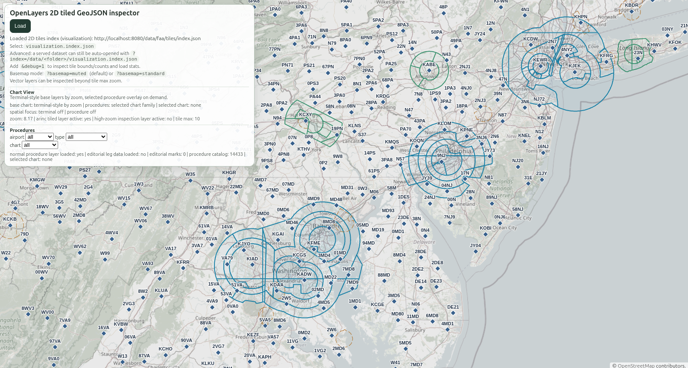
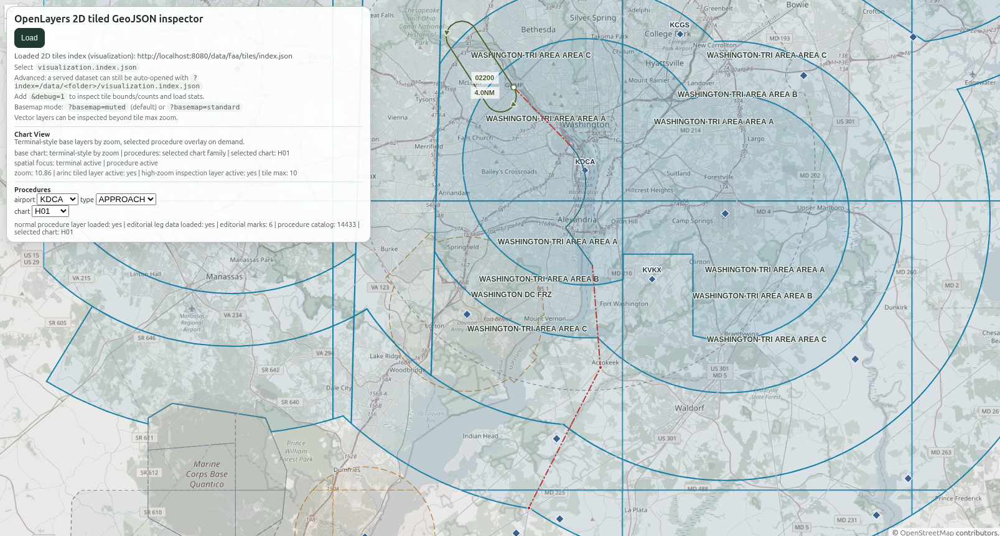
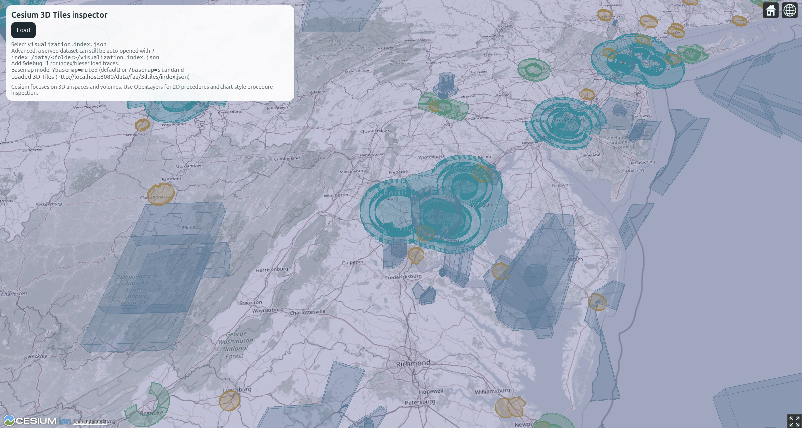

# arinc424-toolkit

Modular JavaScript and Node.js workspace for ARINC 424 parsing, canonical normalization, feature generation, tiled GeoJSON, 3D Tiles, analysis, and interactive viewers.

<p align="center">
  
  
  
</p>

## Why this repo exists

ARINC 424 tooling in JavaScript is still uncommon, and it often ends up as a single opaque pipeline tied to one dataset or one viewer. This workspace splits the problem into reusable pieces:

- parse ARINC into a canonical model
- derive a normalized geospatial feature model
- generate 2D tiles and 3D tiles
- inspect airports, airspaces, waypoints, and procedures
- visualize the result in OpenLayers and Cesium

It is designed for people who want an ARINC 424 toolkit in JavaScript/Node.js to build pipelines, validate data, or experiment with aviation cartography without rewriting the whole stack.

## Packages

- `@arinc424/toolkit`: convenience metapackage and `arinc` CLI
- `@arinc424/core`: ARINC parsing and canonical model
- `@arinc424/features`: canonical to feature model
- `@arinc424/procedures`: incremental Attachment 5 procedure decoding and geometry helpers
- `@arinc424/analysis`: stats, inspectors, relations, and query helpers
- `@arinc424/tiles`: grouped GeoJSON plus `z/x/y.json` tiling
- `@arinc424/3dtiles`: 3D Tiles build pipeline
- `@arinc424/view`: OpenLayers/Cesium adapters and example viewers

## Install

Single entrypoint:

```bash
npm install @arinc424/toolkit
```

Modular install:

```bash
npm install @arinc424/core @arinc424/features @arinc424/procedures @arinc424/analysis @arinc424/tiles @arinc424/3dtiles @arinc424/view
```

## CLI

Published package usage:

```bash
npm install @arinc424/toolkit
arinc --help
```

Main commands:

```bash
arinc parse <input.dat> <canonical.json>
arinc features <canonical.json> <features.json>
arinc tiles <features.json> <outDir> [--min-zoom N --max-zoom N]
arinc 3dtiles <features.json> <outDir>
arinc stats <canonical-or-features.json> [--json]
arinc inspect-airspace <canonical.json> <id|token> [--json]
arinc inspect-airport <canonical.json> <id|ident> [--json]
arinc inspect-waypoint <canonical.json> <id|ident> [--json]
arinc inspect-procedure <canonical.json> <id|token> [--json]
arinc procedure-geometry <canonical.json> <id|token> [--json]
arinc query <canonical-or-features.json> [--layer L] [--type T] [--id X] [--bbox minX,minY,maxX,maxY] [--prop k=v] [--limit N] [--json]
arinc related <canonical.json> (--airport X | --runway X | --waypoint X | --airway X | --procedure X | --airspace X) --relation R [--json]
arinc validate-relations <canonical.json> [--json]
```

## Quick start

Run the pipeline from one ARINC file:

```bash
# 1. ARINC -> canonical
arinc parse ./data/FAACIFP18.dat ./artifacts/demo/canonical.json

# 2. canonical -> features
arinc features ./artifacts/demo/canonical.json ./artifacts/demo/features.json

# 3. features -> tiled GeoJSON
arinc tiles ./artifacts/demo/features.json ./artifacts/demo/tiles --min-zoom 4 --max-zoom 10

# 4. features -> 3D Tiles
arinc 3dtiles ./artifacts/demo/features.json ./artifacts/demo/3dtiles
```

Programmatic use:

```js
import { core, features, procedures, analysis, tiles, threeDTiles } from "@arinc424/toolkit";

const canonical = await core.parseArincFile("./data/FAACIFP18.dat");
const featureModel = features.buildFeaturesFromCanonical(canonical);
const procedureGeometry = procedures.buildProcedureGeometry(canonical, "procedure:PD:US:KPRC:PRC1:1:RW04");
const stats = analysis.summarizeDataset(canonical);

const { manifest } = tiles.generateTiles(featureModel, {
  outDir: "./artifacts/demo/tiles",
  minZoom: 4,
  maxZoom: 10,
  simplify: true,
  simplifyToleranceByZoom: { 4: 0.1, 6: 0.01, 8: 0.001 }
});

tiles.writeTileManifest(manifest, "./artifacts/demo/tiles/manifest.json");
await threeDTiles.build3DTilesFromFeatures(featureModel, { outDir: "./artifacts/demo/3dtiles" });

console.log(stats.entityCounts);
console.log(procedureGeometry.warnings);
```

## Viewers

Serve the examples:

```bash
npm run view:examples
```

Open:

- OpenLayers: `http://localhost:8080/openlayers-tiles/?index=/artifacts/<dataset>/visualization.index.json`
- Cesium: `http://localhost:8080/cesium-3dtiles/?index=/artifacts/<dataset>/visualization.index.json`

Useful query params:

- `&debug=1`
- `&basemap=muted`
- `&basemap=standard`

Current viewer focus:

- OpenLayers: 2D chart-like inspection for airspaces, aerovías, procedures, and waypoints
- Cesium: 3D airspace and volume view

## Large dataset run

Use the integration runner for a full dataset:

```bash
npm run dataset:run -- \
  --input /path/to/FAACIFP18.dat \
  --out ./artifacts/faacifp18 \
  --dataset FAACIFP18
```

This produces, among other outputs:

- `canonical.json`
- `features.json`
- `tiles/`
- `3dtiles/`
- `visualization.index.json`

## Current release: 0.1.9

Version `0.1.9` focuses on richer procedure depiction and more scalable viewer loading:

- per-leg semantic and chart depiction models in `@arinc424/procedures`
- chart-style OpenLayers rendering for holds, arcs, open legs, and editorial marks
- lightweight `procedure-catalog.json` plus per-procedure artifacts for browser-friendly loading
- cleaner procedure selection by chart family instead of isolated transition records
- improved shared cartography tokens and better Cesium/OpenLayers color alignment
- richer navaid display classes and improved 3D airspace styling controls

Procedure support in `@arinc424/procedures` currently includes:

- `IF`
- `TF`
- `CF`
- `DF`
- `RF`
- `AF`
- `HA`
- `HF`
- `HM`
- `CA`
- `FA`
- `VA`
- `VI`
- `VM`
- `FM`

This is still an incremental Attachment 5 implementation, not a full FMS-grade engine.

## Architecture

```text
ARINC424 -> @arinc424/core -> canonical model
          -> @arinc424/procedures -> procedure geometry helpers
          -> @arinc424/features -> feature model
          -> @arinc424/analysis -> stats / inspect / query
          -> @arinc424/tiles -> layers + clipped tiles + manifest
          -> @arinc424/3dtiles -> 3D Tiles artifacts
          -> @arinc424/view -> viewers and cartography helpers
```

Dependency direction:

- `core` -> none
- `features` -> `core`
- `procedures` -> `core`
- `analysis` -> `core`, `features`
- `tiles` -> `features`
- `3dtiles` -> `features`
- `view` -> consumes outputs

## Quality commands

```bash
npm install
npm test
npm run test:golden
npm run test:smoke
npm run bench
npm run update:golden
```

## Documentation

- [CHANGELOG.md](./CHANGELOG.md)
- `docs/analysis.md`
- `docs/cartography.md`
- `docs/procedures.md`
- `docs/view-debug.md`
- `docs/large-dataset.md`
- `docs/testing.md`
- `docs/arinc-airspace-geometry.md`

## Scope notes

- `@arinc424/tiles` supports optional zoom-dependent simplification through `simplifyToleranceByZoom`.
- Unsupported path terminators are preserved explicitly in metadata and warnings.
- Parser robustness covers FAA CIFP and Jeppesen baseline datasets without weakening canonical validation.
- OpenLayers is the primary 2D inspection surface; Cesium is the 3D context surface.
